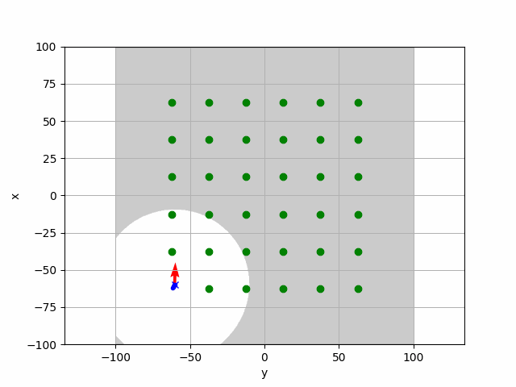

# Installation

<a target="_blank" href=""></a>

### AirSim

1. Create file `~/Documents/AirSim/settings.json` (example below)
2. Download environment binary (Linux): [https://github.com/Microsoft/AirSim/releases](https://github.com/Microsoft/AirSim/releases)
   1. After, unzip
(change this for different environments) Run: ``./AbandonedPark/LinuxNoEditor/AbandonedPark/Binaries/Linux/AbandonedPark -ResX=640 -ResY=480 -windowed``
3. Install ROS wrapper: [https://microsoft.github.io/AirSim/airsim_ros_pkgs/](https://microsoft.github.io/AirSim/airsim_ros_pkgs/)
   1. Once the sim is running, and ros environment is sourced (setup.bash)
   2. `roslaunch airsim_ros_pkgs airsim_node.launch `
   3. `roslaunch airsim_ros_pkgs rviz.launch`

### FastSAM Perception Frontend

TODO

### `active_slam` Python Package

`cd` into this directory and `pip install .`

### `tmuxp`

```
sudo apt install tmuxp
```

# Setup

`cd` into this directory and run

```
source ./utils/cp_settings.sh
```

to setup the AirSim settings.

# Running the full system

Open up `tmux/perception_exploration.yaml`.
In the top of the file are a few environment parameters that you should modify (alternatively, you can enter these in the commandline but tbh it should be easier to just edit them once in the file).

Run:

```
tmuxp load ./tmux/perception_exploration.yaml 
```

You can visualize by opening up rviz:

```
rviz -d ./rviz/active_slam.rviz
```

# Running Kota's active planner

1. start rosmaster (``roscore``)
2. start AirSim env of your choice (``./AbandonedPark/LinuxNoEditor/AbandonedPark/Binaries/Linux/AbandonedPark -ResX=640 -ResY=480 -windowed``)
3. start ros wrapper for AirSim (``roslaunch airsim_ros_pkgs airsim_node.launch``)
4. start planner (``roslaunch active slam planner_ros_node.launch``)

### if you want to change parameters

* you can pass params in planner (``roslaunch airsim_ros_pkgs airsim_node.launch car_or_drone:=drone altitude:=50.0 coverage_area_size:=100.0 exploration_goal_points_resolution:=10.0 exploration_velocity:=5.0``)
* exposed parames
  * ``car_or_drone``: vehicle type (currently car is not supported)
  * ``altitude``: exploratoin altitude
  * ``coverage_area_size``: coverage area size (currenty only square)
  * ``exploration_goal_points_resolution``: distance between goal points in exploration
  * ``exploration_velocity``: velocity constraint in exploration
